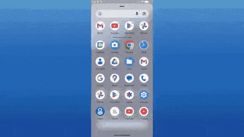

# Stash

A fully offline mobile budgeting app that tracks income, expenses, and transfers across multiple accounts — with per-category budgets and spending statistics.

Final project for **CCS 8 (Human–Computer Interaction)**, Silliman University College of Computer Studies. Built as a team of three; our first Flutter project.



> 🎬 **Watch the tutorial** — on [YouTube](https://youtu.be/wMN_7Li9j-I), or from inside the app under *Tutorial*.

---

## Problem

Most budgeting tools assume you already track everything. Notes apps are unstructured, spreadsheets are overkill, and financial apps are cluttered with ads and sign-up walls. People just want to know: *where did my money go this month?*

## Solution

A simple, on-device app focused on that one question.

- **Transactions** — log income, expenses, and transfers in a few taps, with categories and notes
- **Accounts** — multiple accounts, each with its own running balance
- **Statistics** — monthly summaries, spending by category, and 6-month trends in chart form
- **Budgets** — set a monthly limit per category and watch spending against it
- **Privacy by design** — everything is stored locally; no accounts, no ads, no cloud

## What's unique: an HCI-driven process

Because this was an HCI course project, the design was shaped by iterative user feedback, not just feature checklists:

- **User testing loops.** Each round of testing produced concrete fixes — clearer form validation, a required transfer-fee field, and a calmer visual tone — visible in the commit history.
- **Accessibility.** Light/dark mode and adjustable font size for different visual needs.
- **One-handed use.** Content is constrained to a comfortable reading width on bigger screens.

## Built with

| What | Used for |
|---|---|
| Flutter / Dart | cross-platform mobile UI |
| Riverpod | state management |
| Isar | on-device local database |
| fl_chart | spending statistics and charts |
| shared_preferences, intl, flutter_launcher_icons | settings, formatting, branding |

## Running the project

1. **Install the [Flutter SDK](https://docs.flutter.dev/get-started/install)**.
2. **Install dependencies**
   ```bash
   flutter pub get
   ```
3. **Run the app**
   ```bash
   flutter run
   ```

Everything runs locally on-device — no accounts, servers, or configuration needed.

---
